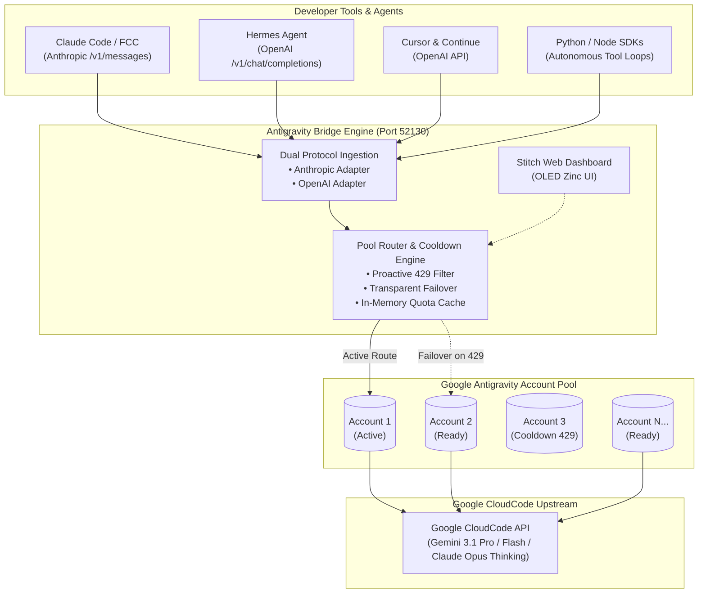

<div align="center">

# ⚡ Antigravity Bridge

### Universal Multi-Account AI Gateway & Proxy for Google Antigravity (CloudCode)

**Zero-downtime, auto-failover quota pool and dual-protocol gateway (Anthropic & OpenAI) for Claude Code, Hermes Agent, Cursor, Continue, and Custom Agentic Loops.**

[](https://opensource.org/licenses/ISC)
[](https://nodejs.org/)
[](https://docs.anthropic.com/)
[](https://stitch.withgoogle.com/)

[**Features**](#-features) • [**Quick Start**](#-quick-start) • [**Client Guides**](#-client-integration-guides) • [**Web Dashboard**](#-web-dashboard) • [**API Docs**](#-api-reference) • [**CLI Reference**](#-cli-commands)

---

</div>

## 📌 Overview

**Antigravity Bridge** transforms multiple personal or team Google accounts into a single, high-availability, unified AI inference endpoint. 

When developing with advanced coding agents like **Claude Code**, **Hermes**, or **Cursor**, hitting Google CloudCode's rate limits (`HTTP 429 RESOURCE_EXHAUSTED` / *"Individual quota reached"*) halts your momentum. Antigravity Bridge solves this by pooling multiple Google accounts and providing **automatic, transparent failover**. If your active account hits a rate limit, the bridge instantly routes the request to the next available account in the pool without dropping your session, tool call, or stream.



---

## ✨ Features

- 🔄 **Unified Multi-Account Quota Pool**: Combine 2, 6, or 20+ Google accounts into a single virtual pool.
- ⚡ **Transparent 429 Auto-Failover**: When an account reaches its quota limit, requests and streaming chunks automatically roll over to the next available account. Zero dropped prompts or interrupted tasks.
- ⏱️ **Dual Rolling Quota Telemetry**: Live extraction and monitoring of Google's internal **5-Hour Rolling Limit %** and **Weekly Cycle Cap %** per account.
- 🔌 **Dual-Protocol Translation**:
  - **Anthropic Messages API** (`/v1/messages`): Full streaming SSE, extended thinking blocks (`claude-opus-4-6-thinking`), and multi-turn tool calling.
  - **OpenAI Chat Completions** (`/v1/chat/completions`): Full streaming, `tool_calls` schemas, `reasoning_effort` mapping, and function execution.
- 🎨 **Google Stitch Web Dashboard**: High-craft web interface built to Google Stitch specifications (`DESIGN.md`) in **Minimalist OLED Zinc** dark mode, with smooth live countdown timers, activity streams, and an interactive theme switcher.
- 🔑 **Automated PKCE OAuth & Background Refresh**: One-click Google login via web browser. Tokens refresh automatically in the background before expiration.
- 🖥️ **macOS LaunchAgent Support**: Native background daemon running automatically on system startup.

---

## 🧠 Supported Models

Model ids are **Google's own ids, sent verbatim** — what you configure is exactly what runs. Every
figure below comes from Google's `fetchAvailableModels`; re-check it any time with
`npm run bridge:models`, which reports anything that has drifted.

| Model ID | Thinking budget | Context | Output | Best suited for |
| :--- | :--- | :--- | :--- | :--- |
| `claude-opus-4-6-thinking` | 1,024 | 250K | 64K | Complex refactors, deep reasoning |
| `claude-sonnet-4-6` | 1,024 | 250K | 64K | High-speed agentic coding, daily pair-programming |
| `gemini-3.1-pro-high` | 10,001 | 1M | 65K | Hardest reasoning — 10× the budget of the Low tier |
| `gemini-3.1-pro-low` | 1,001 | 1M | 65K | Pro-class answers when reasoning depth is not the bottleneck |
| `gemini-2.5-pro` | 1,024 | 1M | 65K | Robust general development |
| `gemini-3.6-flash-high` | dynamic | 1M | 65K | **Google's own default agent model** |
| `gemini-3.6-flash-medium` | 4,000 | 1M | 65K | Fast multi-step work |
| `gemini-3.6-flash-low` | 1,000 | 1M | 65K | High-speed tool loops |
| `gemini-3-flash-agent` | dynamic | 1M | 65K | Gemini 3.5 Flash, high tier |
| `gemini-3.5-flash-low` | 4,000 | 1M | 65K | Gemini 3.5 Flash, medium tier |
| `gemini-3.5-flash-extra-low` | 1,000 | 1M | 65K | Gemini 3.5 Flash, low tier |
| `gemini-3-flash` | dynamic | 1M | 65K | General fast generation |
| `gemini-3.1-flash-lite` | — | 1M | 65K | Ultra-low latency, no reasoning |
| `gpt-oss-120b-medium` | 8,192 | 131K | 32K | GPT-OSS 120B via Antigravity |

**"dynamic"** means the model sizes its own reasoning. The bridge forwards that rather than pinning
a number, since an explicit budget would switch it off.

### Controlling reasoning

Each model carries its own default budget, so the same request reasons differently per model.

- **Anthropic API**: `thinking: { budget_tokens: N }`, or `thinking: { type: "disabled" }`.
- **OpenAI API**: `reasoning_effort` scales that model's default — `low` is a quarter of it,
  `medium` is it, `high` is four times it. `reasoning_tokens: N` sets an exact figure.

Thinking tokens count against `max_tokens`, so the bridge fits the budget inside whatever cap you
send and holds back 8,192 tokens for the visible answer. Tune that with
`BRIDGE_ANSWER_RESERVE_TOKENS` — lower it for more reasoning, raise it if long answers get
truncated. `npm run bridge:usage` reports the reasoning tokens actually consumed.

### Renamed ids

The previous table advertised models it did not deliver: `gemini-3-pro` pointed at a model Google
no longer serves, `gemini-3.1-pro` was pinned to the Low tier, and five separate flash ids all
resolved to the same `gemini-3-flash`. Those ids still resolve, now to the model they claimed to
be, but prefer the real ids above.

| Old id | Now resolves to |
| :--- | :--- |
| `gemini-3.1-pro`, `gemini-3-pro` | `gemini-3.1-pro-high` |
| `gemini-3.6-flash-high`, `gemini-3.6-flash-high-high`, `gemini-3.7-flash-high` | `gemini-3.6-flash-high` |
| `gemini-3.7-flash` | `gemini-3.6-flash-medium` |
| `gemini-2.5-flash` | `gemini-3.1-flash-lite` |

---

## 🚀 Quick Start

### 1. Prerequisites
- **Node.js**: v18.0.0 or later (v20+ recommended)
- **Package Manager**: `npm`, `pnpm`, or `bun`
- A Google account with access to Google Antigravity / CloudCode

### 2. Installation

Clone this repository and install dependencies:

```bash
# Clone the repository
git clone https://github.com/your-org/antigravity-bridge.git
cd antigravity-bridge

# Install dependencies
npm install
```

### 3. Connect Your First Google Account

Run the interactive OAuth login:

```bash
npm run bridge:login
```
*A browser window will open. Sign in with your Google account. The OAuth tokens and project metadata will be securely stored in `~/.zcode/antigravity-accounts.json`.*

### 4. Add Additional Accounts to the Pool

You can add as many Google accounts as you want to expand your quota headroom:

```bash
# Run login again in a browser where you are signed in to your secondary account:
npm run bridge:login
```
*Or open the Web Dashboard and click **"+ Add Account"** in the top right.*

### 5. Start the Bridge Server

```bash
# Start standalone server
npm run bridge:start
```

The server will start on **`http://127.0.0.1:52130`**:
- 🌐 **Web Dashboard**: `http://127.0.0.1:52130/`
- 📨 **Anthropic API**: `http://127.0.0.1:52130/v1/messages`
- 🤖 **OpenAI API**: `http://127.0.0.1:52130/v1/chat/completions`
- 🩺 **Health Check**: `http://127.0.0.1:52130/health`

---

## 🤖 Client Integration Guides

### 1. Claude Code & Free Claude Code (FCC)

Configure official **Claude Code** or community runners to point to the local Anthropic endpoint:

```bash
export ANTHROPIC_BASE_URL="http://127.0.0.1:52130"
export ANTHROPIC_API_KEY="antigravity-local"

# Start Claude Code
claude
```

If using `fcc` (Free Claude Code):
```bash
export ANTHROPIC_BASE_URL="http://127.0.0.1:52130"
fcc
```

---

### 2. Hermes Autonomous Agent

Hermes Agent connects via the OpenAI compatible endpoint. Add the provider to `~/.hermes/config.yaml`:

```yaml
providers:
  antigravity:
    base_url: "http://127.0.0.1:52130/v1"
    api_key: "antigravity-local"
```

Run Hermes with Gemini 3.6 Flash (High):
```bash
# One-shot command execution
hermes --provider antigravity -m gemini-3.6-flash-high -z "Check workspace files and run unit tests"

# Interactive TUI mode
hermes --provider antigravity -m gemini-3.6-flash-high --tui
```

---

### 3. Cursor IDE & Continue.dev

In **Cursor** (`Settings > Models > OpenAI`):
1. **OpenAI API Key**: `antigravity-local`
2. **Override OpenAI Base URL**: `http://127.0.0.1:52130/v1`
3. Add model names: `gemini-3.6-flash-high`, `claude-opus-4-6-thinking`, `gemini-3.1-pro-high`

In **Continue.dev** (`~/.continue/config.json`):
```json
{
  "models": [
    {
      "title": "Gemini 3.6 Flash High (Antigravity)",
      "provider": "openai",
      "model": "gemini-3.6-flash-high",
      "apiBase": "http://127.0.0.1:52130/v1",
      "apiKey": "antigravity-local"
    }
  ]
}
```

---

### 4. Python OpenAI SDK (Tool Execution & Reasoning)

Standard OpenAI Python SDK scripts work out of the box with function calling and multi-turn tool loops:

```python
from openai import OpenAI

client = OpenAI(
    base_url="http://127.0.0.1:52130/v1",
    api_key="antigravity-local"
)

response = client.chat.completions.create(
    model="gemini-3.6-flash-high",
    messages=[
        {"role": "system", "content": "You are an expert autonomous assistant."},
        {"role": "user", "content": "What is the capital of Indonesia?"}
    ],
    extra_body={"reasoning_effort": "high"}
)

print(response.choices[0].message.content)
```

---

### 5. cURL Direct Request

#### OpenAI Chat Completion:
```bash
curl -s -X POST http://127.0.0.1:52130/v1/chat/completions \
  -H "Content-Type: application/json" \
  -H "Authorization: Bearer antigravity-local" \
  -d '{
    "model": "gemini-3.6-flash-high",
    "messages": [{"role": "user", "content": "Hello!"}]
  }'
```

#### Anthropic Messages:
```bash
curl -s -X POST http://127.0.0.1:52130/v1/messages \
  -H "Content-Type: application/json" \
  -H "x-api-key: antigravity-local" \
  -H "anthropic-version: 2023-06-01" \
  -d '{
    "model": "claude-sonnet-4-6",
    "max_tokens": 100,
    "messages": [{"role": "user", "content": "Hello from Anthropic protocol!"}]
  }'
```

---

## 🎨 Web Dashboard

Open **`http://127.0.0.1:52130`** in your browser to access the management interface:

- **OLED Zinc Aesthetics**: Pitch-black canvas (`#000000`) with high-contrast chrome elements and concentric card radii following the **Google Stitch Design System** (`DESIGN.md`).
- **Live Account Grid**:
  - `● Active`: Currently handling primary traffic.
  - `○ Ready`: Standing by for failover or manual switch.
  - `⏳ Cooling Down`: Rate-limited by Google (HTTP 429) with live ticking countdown timer (*"Resets in 1h 14m 20s"*).
- **Dual Live Quotas**: Real-time bars showing internal 5-hour rolling limit and weekly cycle cap percentages.
- **One-Click Actions**:
  - **Set Active**: Manually route traffic to a specific account.
  - **Clear Cooldown**: Reset the rate limit timer on an account.
  - **Delete**: Remove an account from storage.
  - **Auto-Failover Toggle**: Enable/disable automatic switching.
- **Interactive Theme Switcher**: Choose between **OLED Zinc** (Default), **Gemini Cosmic**, **Claude Studio**, or **Cyber Emerald**.

---

## 📡 API Reference

### Management Endpoints

| Method | Endpoint | Description |
| :--- | :--- | :--- |
| `GET` | `/health` | Service status, current active account, and supported models list |
| `GET` | `/api/pool` | Complete pool state, all accounts with live quota telemetry, and recent events |
| `POST` | `/api/pool/switch` | Switch active account (`{"email": "user@gmail.com"}`) |
| `POST` | `/api/pool/toggle` | Toggle auto-failover engine ON/OFF |
| `POST` | `/api/pool/clear-cooldown` | Manually clear cooldown on an account (`{"email": "user@gmail.com"}`) |
| `POST` | `/api/pool/delete` | Remove an account from the pool (`{"email": "user@gmail.com"}`) |
| `GET` | `/api/pool/auth-url` | Generate Google OAuth PKCE authorization URL for browser login |

### Inference Endpoints

| Method | Endpoint | Compatible Client |
| :--- | :--- | :--- |
| `POST` | `/v1/messages` | Anthropic Claude Code, Free Claude Code, Anthropic Python/Node SDK |
| `POST` | `/v1/chat/completions` | Hermes Agent, Cursor, Continue.dev, OpenAI Python/Node SDK |

---

## 🛠️ CLI Commands

Antigravity Bridge provides a set of CLI shortcuts:

```bash
# Account & Pool Management
npm run bridge:accounts          # List all saved Google accounts and active status
npm run bridge:switch <id/email> # Switch the active account by index or email address
npm run bridge:login             # Launch interactive browser login for a new account
npm run bridge:status            # Check token validity and connection status
npm run bridge:usage             # View request count, token usage, and reasoning tokens consumed
npm run bridge:models            # Check the model table against what Google actually serves

# macOS Background Service (LaunchAgent)
npm run bridge:service:install   # Install & start background launchd daemon (auto-start on boot)
npm run bridge:service:uninstall # Stop & remove the background launchd service

# Verification Suite
npm run test:bridge              # Run full end-to-end multi-protocol test suite
```

---

## ⚙️ macOS Background Daemon (LaunchAgent)

To run Antigravity Bridge continuously in the background on macOS without keeping a terminal open:

```bash
npm run bridge:service:install
```

- Plist Configuration: `~/Library/LaunchAgents/com.antigravity.zcode-bridge.plist`
- Standard Logs: `~/.zcode/logs/antigravity-bridge.log`
- Error Logs: `~/.zcode/logs/antigravity-bridge.err.log`

To restart or inspect the service:
```bash
# Restart service
launchctl kickstart -k gui/$(id -u)/com.antigravity.zcode-bridge

# View live logs
tail -f ~/.zcode/logs/antigravity-bridge.log
```

---

## 🔒 Security & Privacy

- **Bind address**: the server listens on `0.0.0.0` by default, so it is reachable from your network. Set `BRIDGE_HOST=127.0.0.1` to restrict it to this machine.
- **Authentication**: requests over loopback are trusted, so a local install needs no configuration. Anything else must present a shared secret:

  ```bash
  export BRIDGE_API_KEY="$(openssl rand -hex 32)"   # on the machine running the bridge
  npm run bridge:start
  ```

  Remote clients send it as `Authorization: Bearer <key>` or `x-api-key: <key>` — the same headers they already use for an API key, so point `ANTHROPIC_API_KEY` / `OPENAI_API_KEY` at it instead of `antigravity-local`. The web dashboard prompts for the key once and remembers it in that browser.

  **If you expose this bridge beyond your own machine, set `BRIDGE_API_KEY`.** Without it, remote requests are refused rather than served — the endpoints hand out pooled Google quota and can delete accounts from the pool, so an unauthenticated public deployment is not a supported configuration. Set `BRIDGE_TRUST_LOCAL=0` to require the key on loopback too.
- **Local Credential Storage**: All OAuth access tokens and refresh tokens are stored locally in `~/.zcode/antigravity-accounts.json` with user-level read permissions.
- **No Third-Party Intermediaries**: Requests flow directly between your machine and Google's official CloudCode servers. No telemetry, prompts, or code are sent to any external server.

---

## 📄 License

This project is licensed under the [ISC License](LICENSE).
